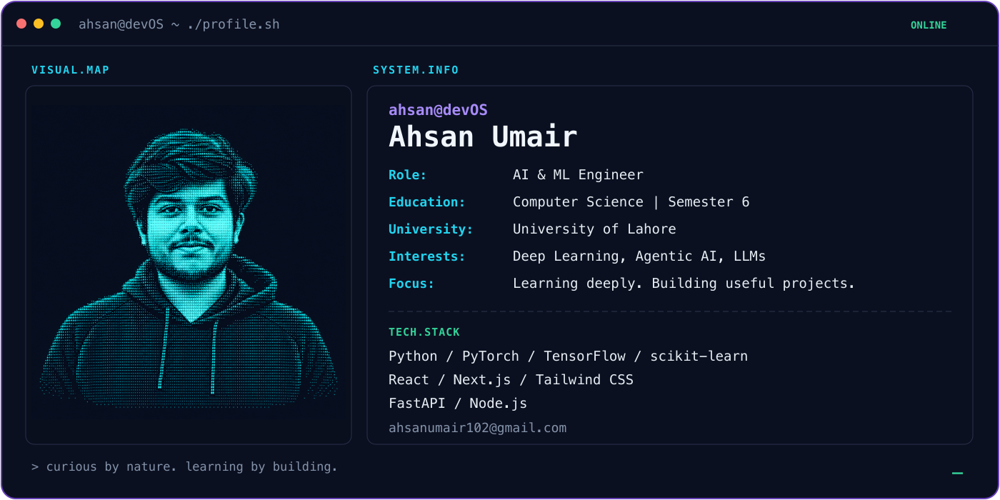
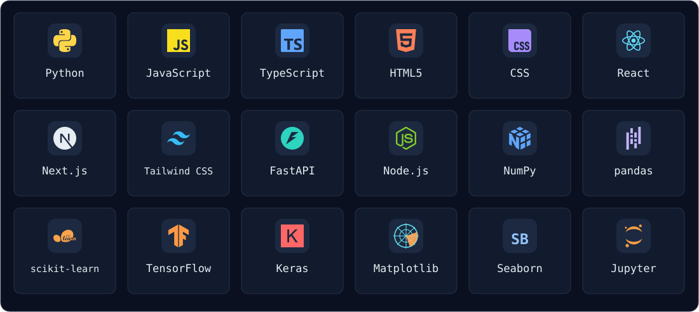

  

---

## About Me

I'm **Ahsan Umair**, an **AI & ML engineer** and a sixth-semester Computer Science student at the **University of Lahore**.

I learn through hands-on projects in machine learning, deep learning, and full-stack development. I'm interested in building AI agents, working with LLMs, and turning ideas into useful applications.

### Current Focus

- Strengthening my foundations in **deep learning**.
- Building and documenting practical deep learning projects.
- Exploring **agentic AI** and **LLM-powered applications**.

---

## What I Build

| Area | My work and interests |
| --- | --- |
| Machine learning | Prediction, classification, clustering, and anomaly-detection projects |
| Deep learning | Perceptron exercises and neural-network projects with TensorFlow/Keras |
| Full-stack applications | React/Next.js interfaces and FastAPI/Node.js backends |
| AI agents & LLMs | Exploring ways to build useful AI-powered applications |

## Tech Stack

  

Also used in **Model Lab**: SQLite/Turso, MySQL, Streamlit, TanStack Query, and Recharts.

---

## Featured Projects

| Project | What it does |
| --- | --- |
| [Model Lab](https://github.com/Ahsan-Umair/ml-tracker) | A personal ML model registry and experiment tracker built with Next.js, React, TypeScript, Tailwind CSS, FastAPI, and SQLite/Turso. |
| [Deep Learning](https://github.com/Ahsan-Umair/Deep-Learning) | Perceptron exercises and TensorFlow/Keras neural-network projects for customer churn and graduate admission prediction. |
| [Spam Email Detector](https://github.com/Ahsan-Umair/Spam-Email-Detector-ML-Project) | Text classification using TF-IDF, logistic regression, and random forests. |
| [Customer Segmentation](https://github.com/Ahsan-Umair/Customer-Segmentation-ML-Project) | Compares K-means, hierarchical clustering, and DBSCAN to explore customer purchasing behavior. |
| [Fraud Anomaly Detection](https://github.com/Ahsan-Umair/Anomaly-Fraud-Detection-Unsupervised-ML-Project) | An educational Isolation Forest experiment for detecting unusual credit-card transactions. |

[Explore all my repositories →](https://github.com/Ahsan-Umair?tab=repositories)

---

## Coding Practice

I practice problem-solving on [LeetCode — AHSAN_UMAIR](https://leetcode.com/u/AHSAN_UMAIR/).

## Connect With Me

  
  
  

<a href="mailto:ahsanumair102@gmail.com">ahsanumair102@gmail.com</a>

